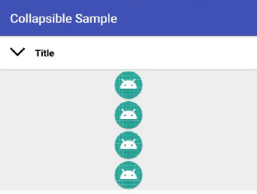
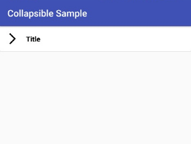

# CollapsibleLayout
CollapsibleLayout, CollapsibleHeaderView and CollapsibleFragment on Android.
It is easy to use, and you get smooth animation.

  

If you clone and build this project. You can see some use cases in sample apps.

## Features
Provide 3 UI elements: CollapsibleLayout, CollapsibleHeaderView, CollapsibleFragment

1. CollapsibleLayout
    * A FrameLayout with collapse and expand animations.
1. CollapsibleHeaderView
    * Pre-designed header view to be used above CollapsibleLayout and its animation trigger.
    * Set title with style and show arrow image with animation.
    * Change title area to user own custom view.
    * Change whole header area to user own custom view.
1. CollapsibleFragment
    * Easy way to use CollapsibleLayout with CollapsibleHeaderView.

## Download with gradle
```gradle
repositories {
    jcenter()
}

dependencies {
    implementation 'com.github.gomsoo:collapsible-layout:1.0.0'
}
```

## Usage

#### Case 1. Using CollapsibleLayout only


In xml
```xml
<com.gomsoo.collapsible.CollapsibleLayout
    android:id="@+id/collapsibleLayoutOnly"
    android:layout_width="match_parent"
    android:layout_height="wrap_content">

    <TextView
      android:layout_width="wrap_content"
      android:layout_height="wrap_content"
      android:layout_gravity="center"
      android:text="Hello, CollapsibleLayout!" />

</com.gomsoo.collapsible.CollapsibleLayout>
```
In code
```java
CollapsibleLayout collapsibleLayout = findViewById(R.id.collapsibleLayoutOnly);
collapsibleLayout.setHandler(YOUR_BUTTON);
collapsibleLayout.setMarkViewForAnimation(YOUR_IMAGE_VIEW);
```


#### Case 2. Using CollapsibleLayout with CollapsibleHeaderView

In xml
```xml
<com.gomsoo.collapsible.CollapsibleHeaderView
    android:id="@+id/collapsibleHeaderView"
    android:layout_width="match_parent"
    android:layout_height="wrap_content"
    app:collapsible_markPosition="end"
    app:collapsible_showColorBand="false"
    app:collapsible_title="CollapsibleHeaderView"
    app:collapsible_titleSize="18sp" />

    <com.gomsoo.collapsible.CollapsibleLayout
        android:id="@+id/collapsibleLayout"
        android:layout_width="match_parent"
        android:layout_height="wrap_content">

        <!-- Your contents here -->

    </com.gomsoo.collapsible.CollapsibleLayout>
```
In code
```java
CollapsibleHeaderView collapsibleHeaderView = findViewById(R.id.collapsibleHeaderView);
CollapsibleLayout collapsibleLayout = findViewById(R.id.collapsibleLayout);
collapsibleLayout.setHandler(collapsibleHeaderView);
```


#### Case 3. Using CollapsibleFragment

```xml
<fragment
    android:id="@+id/collapsibleFragment"
    android:name="com.gomsoo.collapsible.CollapsibleFragment"
    android:layout_width="match_parent"
    android:layout_height="wrap_content"
    app:collapsible_content="@layout/collapsible_content"
    app:collapsible_showColorBand="false"
    app:collapsible_title="@string/title"
    app:collapsible_titleColor="@color/colorAccent"
    app:collapsible_titleSize="20sp"
    app:collapsible_titleStyle="bold" />
```

If you use methods of fragment instead of using attributes in xml, add dependency in `build.gradle` of your module(app) level.

```gradle
dependencies {
    ...
    implementation 'com.android.support:cardview-v7:27.0.2'
}
```
```java
CollapsibleFragment collapsibleFragment = getSupportFragmentManager().getFragmentById(R.id.collapsibleFragment);
collapsibleFragment.setTitle(R.string.title);
collapsibleFragment.setTitleColor(ContextCompat.getColor(this, R.color.colorPrimaryDark));
```


## Xml Attributes
**CollapsibleLayout and CollapsibleFragment**

Name | Values | Description
-----|--------|-------------
collapsible_animationDuration | number |

**CollapsibleHeaderView and CollapsibleFragment**

Name | Values | Description
-----|--------|-------------
collapsible_markPosition | start / end |
collapsible_showColorBand | boolean |
collapsible_title | text |
collapsible_titleStyle | bold / italic |
collapsible_titleSize | dimension | eg. 18sp
collapsible_titleColor | color | eg. #ff123456, @color/beautifulCyan
collapsible_mark | drawable | Set the image to indicate when it is in the "expanded" state.
collapsible_customHeaderLayout | layoutId | Your own layout file to replace the whole header area.
collapsible_customTitleLayout | layoutId | Your own layout file to replace the title area.

**CollapsibleFragment only**

Name | Values | Description
-----|--------|-------------
collapsible_content | layoutId | Content layout


## Methods

**CollapsibleLayout**

Return | Method(Parameters) | Description
-------|--------------------|-------------
`void` | `setHandler(View)` | Set a view to be trigger of the Layout's collapse and expand operation.
`void` | `setMarkViewForAnimation(View)` | Set a view that represents collapsed or expanded state. Default image of the view should indicate expanded state like arrow down image. If you use CollapsibleHeaderView as a handler, you don't need to call this method.
`void` | `setAnimationDuration(long)` | Duration in milliseconds for animation.
`void` | `collapse()` | Close layout.
`void` | `expand()` | Open layout.
`void` | `collapse(long)` | Close layout with the duration passed as parameter. The passed duration is temporary value. The property that you have set by calling `setAnimationDuration(long)` will not changed.
`void` | `expand(long)` | Open layout. It works same as `collapse(long)`.
`void` | `toggle()` | Open if the layout was collapsed, otherwise close.
`void` | `toggle(long)` | Open if thelayout was collapsed, otherwise close.
`boolean` | `isCollapsed()` | Return true if the layout is collapsed, otherwise false.
`boolean` | `isExpanded()` | Return true if the layout is expanded, otherwise false.


**CollapsibleHeaderView**


**CollapsibleFragment**


## License
>MIT License
>
>Copyright (c) 2018
>
>Permission is hereby granted, free of charge, to any person obtaining a copy
>of this software and associated documentation files (the "Software"), to deal
>in the Software without restriction, including without limitation the rights
>to use, copy, modify, merge, publish, distribute, sublicense, and/or sell
>copies of the Software, and to permit persons to whom the Software is
>furnished to do so, subject to the following conditions:
>
>The above copyright notice and this permission notice shall be included in all
>copies or substantial portions of the Software.
>
>THE SOFTWARE IS PROVIDED "AS IS", WITHOUT WARRANTY OF ANY KIND, EXPRESS OR
>IMPLIED, INCLUDING BUT NOT LIMITED TO THE WARRANTIES OF MERCHANTABILITY,
>FITNESS FOR A PARTICULAR PURPOSE AND NONINFRINGEMENT. IN NO EVENT SHALL THE
>AUTHORS OR COPYRIGHT HOLDERS BE LIABLE FOR ANY CLAIM, DAMAGES OR OTHER
>LIABILITY, WHETHER IN AN ACTION OF CONTRACT, TORT OR OTHERWISE, ARISING FROM,
>OUT OF OR IN CONNECTION WITH THE SOFTWARE OR THE USE OR OTHER DEALINGS IN THE
>SOFTWARE.
>
